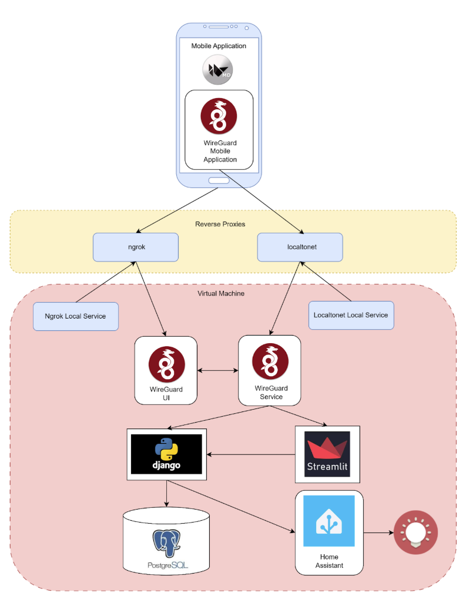

# DIT-thesis

This thesis presents the design and implementation of a self-hosted platform for secure geolocation sharing within closed user groups, using open-source tools and virtualized infrastructure.  
The primary objective is to develop a system that enables users to share their real-time location securely with group members, define geofenced zones, and trigger smart IoT actions based on geolocation events.

## Dockerized services

The system is deployed inside a **Linux** virtual machine where **Docker Compose** orchestrates several services:
- A **Django** backend
- A **PostgreSQL/PostGIS** for data storage,
- A **Streamlit** dashboard for monitoring,
- **Home Assistant** for IoT integration,
- A **WireGuard VPN server** with a management interface.

To ensure secure remote access, the setup employs as reverse proxy tools:
- **Localtonet** 
- **Ngrok**

## Mobile application
The mobile component is developed using the **Kivy framework** and **KivyMD**.  
Users establish a VPN tunnel using the **WireGuard mobile app** using client configurations generated from the WireGuard UI.  
Once connected, the Kivy-based app communicates with the Django backend over the tunnel, sending location updates to be stored in PostgreSQL.

Through the Streamlit dashboard, users can form **private groups**, **invite others**, and **define geofenced zones**.  

Real-time user location monitoring is achieved through periodic polling of backend endpoints.  
When users enter or exit a defined zone, notification events are triggered and pushed to the frontend, and also forwarded to Home Assistant.  

A **TP-Link Tapo smart plug** is integrated to demonstrate geolocation-triggered automation by toggling its power state upon specific zone transitions.

## System architecture

## Demos

